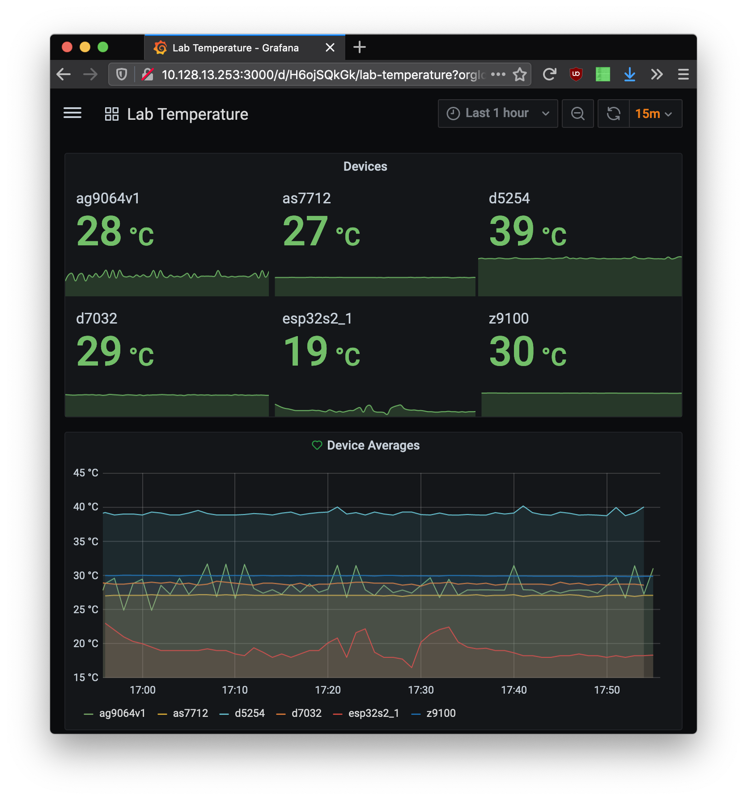
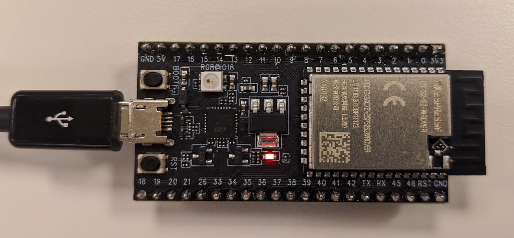
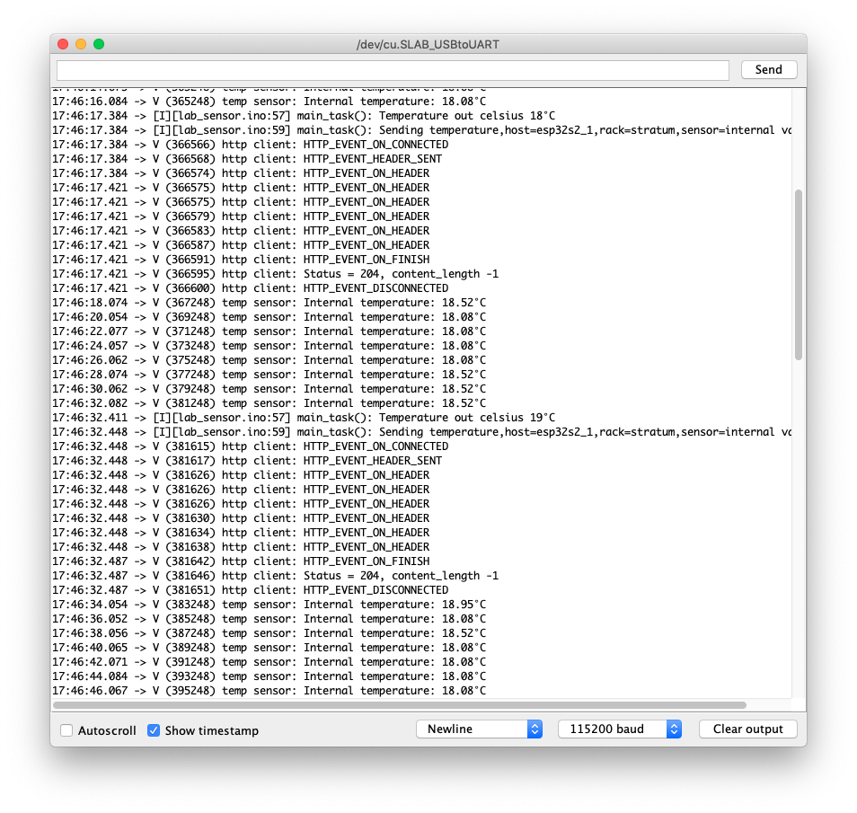

# lab-monitor
DIY lab monitoring with ESP32-S2 SoCs, InfluxDB and Grafana.





# Dependencies

- Docker
- Arduino IDE
- ESP32-S2 SoC(s)

# Sensor

## Development setup

Follow the [arduino-esp32](https://github.com/espressif/arduino-esp32/blob/esp32s2/docs/arduino-ide/mac.md) guide.

## Device configuration

Adjust [config.h](config.h) with your values and an unique `host_name` per device.

# influxdb

```bash
cd influxdb
./start.sh
```

If you have other data sources, like ONLP-enabled switches, add `collect_data.sh`
to the crontab or similar.

# Grafana

```bash
cd grafana
./start.sh
```

[Import](https://grafana.com/docs/grafana/latest/reference/export_import/) the Lab Temperature [Dashboard](grafana/lab-temp-dashboard.json).
